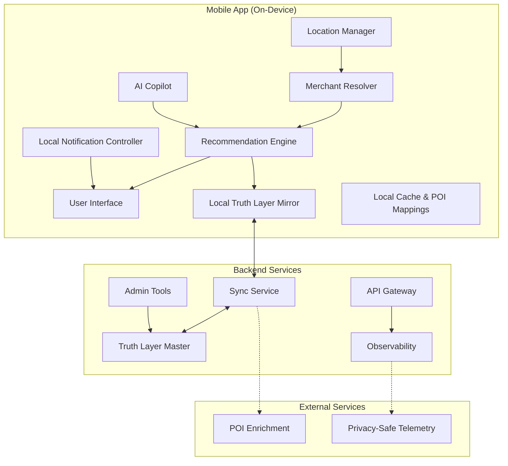

# Design Document: PerkMax Core

## Overview

PerkMax is a mobile application that provides instant, single-card credit card recommendations at the point of purchase. The system architecture prioritizes speed, accuracy, and user trust through a deterministic recommendation engine backed by a structured rules database (Truth Layer).

### Core Design Principles

1. **Deterministic Truth**: All recommendations computed from structured rules, never AI hallucinations
2. **One Answer Contract**: Exactly one card recommendation by default
3. **Confidence Honesty**: Never claim HIGH confidence when uncertain
4. **Zero-Keypad UX**: No typing required for core purchase flow
5. **Speed Moat**: ≤500ms P95 recommendation compute after merchant resolution

### Key Design Decisions

- **Rules-based over ML**: Deterministic rules engine prevents hallucinations and ensures explainable decisions
- **Manual wallet first**: Privacy-focused approach requiring no bank account linking
- **Confidence-driven UX**: Three-tier confidence system (HIGH/MED/LOW) drives different user experiences
- **Location-triggered**: Geofencing triggers automatic recommendations without app opening
- **Offline-capable**: Local caching enables recommendations without network connectivity

## Architecture

### High-Level Architecture



### Data Flow

1. **Location Trigger**: User enters significant location change → Location Manager detects
2. **Merchant Resolution**: GPS coordinates + cached POI mappings → Merchant Resolver → merchant identity + confidence (on-device)
3. **Recommendation**: Merchant + user wallet → Recommendation Engine → single card + explanation (on-device using local Truth Layer)
4. **Delivery**: Result → Local Notification Controller → lock screen notification
5. **Interaction**: User taps → deep link to explanation drawer

### Performance Architecture (Local-First)

- **On-Device Compute**: Recommendation Engine runs locally for sub-100ms response times
- **Local Truth Layer Mirror**: SQLite database with versioned rules for offline operation
- **Repeat Merchant Memory**: POI mappings cached locally for instant HIGH confidence on repeat visits
- **Background Processing**: Location monitoring and merchant resolution without network dependency
- **Backend Sync**: Truth Layer updates, POI enrichment, and privacy-safe telemetry only

### Autopilot Strategy v1 (Feasible on iOS/Android)

**iOS Geofencing Constraints**: 20 region limit requires strategic geofence management

**Dynamic Geofencing Strategy**:
- **User Favorites**: Top 10 frequently visited merchants get dedicated geofences
- **Location-Based**: 5-10 geofences around current location (rolling window)
- **Significant Location Changes**: Use iOS visit detection to wake app, then resolve POI
- **Repeat Merchant Priority**: Confirmed mappings bypass geofencing for instant resolution

**Android Strategy**:
- Similar dynamic geofencing with 100 region limit
- Geofencing API with location services
- Activity recognition for shopping context

**Fallback Mechanisms**:
- Manual merchant search when geofencing unavailable
- Best-by-category recommendations when POI resolution fails
- Cached merchant mappings for offline operation

## Components and Interfaces

### 1. Truth Layer (Local Mirror + Master)

**Purpose**: Structured, versioned database of credit card reward rules that prevents hallucinations.

**Local Mirror Schema**:
```typescript
interface RewardRule {
  rule_id: string;
  card_id: string;
  category: string;
  earn_rate: number;
  merchant_exceptions?: MerchantException[];
  fx_fee_flag: boolean;
  caps?: CapRule[];
  channel_applicability?: 'in_store' | 'online' | 'both';
  amount_thresholds?: AmountThreshold[];
  effective_from: Date;
  effective_to?: Date;
  source_url?: string;
  last_verified_at?: Date;
  rule_confidence: number; // 0-100
  rule_version: number;
  rule_hash: string;
}

interface AmountThreshold {
  threshold: number;
  bonus_rate: number;
  window?: string;
}

interface MerchantException {
  merchant_id: string;
  override_rate?: number;
  excluded: boolean;
}

interface CapRule {
  cap_amount: number;
  cap_period: 'monthly' | 'quarterly' | 'annual';
  reset_date?: Date;
}
```

**Key Operations**:
- `syncFromMaster(): Promise<SyncResult>` - Pull latest rules from backend
- `getRulesForCard(cardId: string, category: string): RewardRule[]` - Local query
- `validateRulesetIntegrity(): ValidationResult` - Check local data consistency

### 2. Merchant Resolver (On-Device)

**Purpose**: Convert GPS coordinates to merchant identity with confidence scoring using local POI mappings.

**Interface**:
```typescript
interface MerchantResolver {
  resolve(location: GPSCoordinate): Promise<MerchantResolution>;
  confirmMapping(userId: string, poiId: string, merchantId: string): Promise<void>;
  getUserOverrides(userId: string): Promise<MerchantOverride[]>;
  updatePOIMappings(mappings: POIMapping[]): Promise<void>;
}

interface MerchantResolution {
  merchant_id?: string;
  display_name: string;
  category: string;
  country_region: string;
  merchant_confidence: number; // 0-100
  confidence_label: 'HIGH' | 'MED' | 'LOW';
  reasons: string[];
  candidates?: MerchantCandidate[]; // For MED confidence
  poi_id?: string; // For repeat merchant memory
}
```

**Resolution Strategy (Local-First)**:
1. **Repeat Merchant Priority**: Check user_id + poi_id mappings first (instant HIGH confidence)
2. **Local POI Matching**: Match coordinates to cached POI database
3. **User Override Priority**: Apply user-confirmed categorizations
4. **Confidence Calculation**: 
   - HIGH (≥80): Confirmed mapping exists + GPS within tolerance
   - MED (50-79): POI match but no user confirmation
   - LOW (<50): No clear POI match, requires manual selection

### 3. Recommendation Engine (On-Device)

**Purpose**: Deterministic selection of single winning card from user's wallet using local Truth Layer.

**Interface**:
```typescript
interface RecommendationEngine {
  recommend(request: RecommendationRequest): Promise<RecommendationResult>;
  explainDecision(recommendationId: string): Promise<ExplanationContract>;
  precomputeBestByCategory(): Promise<CategoryFallbacks>;
}

interface RecommendationResult {
  winning_card: UserCard;
  final_confidence: number;
  confidence_label: 'HIGH' | 'MED' | 'LOW';
  confidence_breakdown: ConfidenceBreakdown;
  explanation: ExplanationContract;
  recommendation_id: string;
  compute_time_ms: number;
}

interface ConfidenceBreakdown {
  merchant_confidence: number;
  rules_confidence: number;
  decision_confidence: number;
  final_confidence: number; // MIN of above three
  confidence_reasons: string[];
}
```

**Decision Algorithm (On-Device)**:
1. **Filter Candidates**: Only cards in user wallet with applicable local rules
2. **Apply Hard Exclusions**: Remove cards with FX fees (international), exhausted caps, merchant exceptions
3. **Score Remaining Cards**: Calculate expected value based on earn rates
4. **Confidence Calculation**: See "Confidence Computation Spec" below
5. **Select Winner**: Highest scoring card with deterministic tie-breaking (stable sort by card_id)

### 4. Location Manager

**Purpose**: Monitor user location and trigger merchant resolution.

**Interface**:
```typescript
interface LocationManager {
  startMonitoring(userId: string): Promise<void>;
  stopMonitoring(): Promise<void>;
  onLocationUpdate(callback: (location: GPSCoordinate) => void): void;
  getCurrentLocation(): Promise<GPSCoordinate>;
}
```

**Implementation Details**:
- **iOS**: Core Location framework with geofencing (20 region limit)
- **Android**: Geofencing API with location services
- **Battery Optimization**: Significant location changes only, adaptive monitoring
- **Privacy**: Minimal location retention, user consent required

### 5. AI Copilot (Structured Pipeline)

**Purpose**: Planning assistant for strategic spending questions with strict orchestration to prevent card selection.

**Interface**:
```typescript
interface AICopilot {
  askQuestion(query: string, context: CopilotContext): Promise<CopilotResponse>;
}

interface CopilotContext {
  user_wallet: UserCard[];
  user_preferences: UserPreferences;
  recent_recommendations: RecommendationResult[];
}

interface CopilotResponse {
  strategy_recommendation: string;
  reasoning: string;
  assumptions: string[];
  next_steps: string[];
  clarifying_questions?: string[]; // Max 2
  engine_outputs_used: RecommendationResult[]; // Proof of grounding
}
```

**Orchestration Pipeline (Prevents Direct Card Selection)**:
1. **LLM Parse**: Convert natural language question → structured scenario
2. **Engine Query**: Run Recommendation Engine for each scenario (deterministic)
3. **LLM Explain**: Generate explanation using only engine outputs
4. **Validation**: Ensure no direct card recommendations without engine proof

**Structured Scenario Format**:
```typescript
interface CopilotScenario {
  merchant_or_category: string;
  channel?: 'in_store' | 'online';
  amount_band?: 'under_50' | '50_200' | '200_1k' | 'over_1k';
  timeframe?: 'single' | 'monthly' | 'annual';
}
```

## Data Models

### User Wallet
```typescript
interface UserCard {
  card_id: string;
  product_id: string; // Links to Truth Layer
  nickname?: string;
  last_four?: string;
  added_date: Date;
  is_active: boolean;
}

interface UserPreferences {
  cashback_vs_points_bias: 'cashback' | 'points' | 'neutral';
  point_valuation?: number; // cents per point
  protection_mode_default: boolean;
  max_notifications_per_day: number;
  quiet_hours?: TimeRange;
}
```

### Merchant Data
```typescript
interface Merchant {
  merchant_id: string;
  display_name: string;
  category: string;
  country_region: string;
  poi_mappings: POIMapping[];
}

interface POIMapping {
  poi_id: string;
  coordinates: GPSCoordinate;
  confidence_score: number;
  last_verified: Date;
}

interface UserMerchantMapping {
  user_id: string;
  poi_id: string;
  merchant_id: string;
  category_override?: string;
  confirmed_at: Date;
  visit_count: number;
}
```

### Recommendation Tracking
```typescript
interface RecommendationLog {
  recommendation_id: string;
  user_id: string;
  merchant_resolution: MerchantResolution;
  winning_card: UserCard;
  confidence_breakdown: ConfidenceBreakdown;
  compute_time_ms: number;
  notification_sent: boolean;
  user_action?: 'viewed' | 'ignored' | 'overridden';
  timestamp: Date;
}

interface NotificationLog {
  notification_id: string;
  user_id: string;
  merchant_id: string;
  notification_type: 'autopilot' | 'rule_update' | 'offer';
  sent_at: Date;
  opened_at?: Date;
  suppressed_reason?: string;
}
```

### Privacy-Safe Location Data
```typescript
interface LocationEvent {
  event_id: string;
  user_id: string;
  poi_id?: string; // No precise coordinates stored
  geohash_prefix: string; // Coarse location for analytics
  event_type: 'enter' | 'exit' | 'visit';
  timestamp: Date;
  confidence: number;
}
```

### Caching Strategy

**Local Cache (Mobile)**:
- User wallet and preferences
- Recent merchant resolutions (30 days)
- Truth Layer rules mirror (full local SQLite)
- POI mappings with user confirmations
- Best-by-category precomputed fallbacks

**Cache Invalidation**:
- Truth Layer rules: Version-based sync with ETag
- Merchant mappings: User confirmation updates immediately
- POI data: 7-day TTL with background refresh

**Offline Behavior**:
- Use cached merchant mappings with repeat merchant priority
- Fall back to best-by-category from precomputed cache
- Queue sync actions for when connectivity returns

### Notification System Strategy

**Local Notifications (Primary)**:
- Triggered by on-device location events and recommendation completion
- No network dependency for core "I'm at the store" flow
- Immediate delivery after recommendation computed locally

**Push Notifications (Secondary)**:
- Truth Layer rule updates that affect user's cards
- New offer detection (Phase 2+)
- System maintenance notifications

**Notification Content Validation**:
- All notifications must include: merchant name, recommended card, reward rationale, confidence label
- Privacy-safe: No precise coordinates, no sensitive card details
- Actionable: Deep link to explanation drawer on tap

## Confidence Computation Spec (Exact)

### Rules_Confidence Calculation (Deterministic)
```typescript
function calculateRulesConfidence(rules: RewardRule[], meta: TruthLayerMeta): number {
  if (rules.length === 0) return 0;
  
  let confidence = Math.min(...rules.map(r => r.rule_confidence));
  
  // Apply penalties
  for (const rule of rules) {
    if (!rule.channel_applicability) confidence -= 5;
    if (PHASE.ENFORCE_LAST_VERIFIED_FRESHNESS && (!rule.last_verified_at || isStale(rule.last_verified_at))) confidence -= 10;
    if (rule.caps && !rule.caps.reset_date) confidence -= 5;
  }
  
  // Apply staleness caps
  confidence = applyStalenessCaps(meta, confidence);
  
  return Math.max(0, confidence);
}
```

### Decision_Confidence Calculation (Deterministic)
```typescript
function calculateDecisionConfidence(
  candidates: UserCard[],
  winner: UserCard,
  exclusions: string[],
  usedFallback: boolean,
  usedTieBreak: boolean,
  amountUnknownButRelevant: boolean
): number {
  let confidence = 100;
  
  if (usedFallback) return 60; // Cap at 60 for fallbacks
  if (usedTieBreak) return 70; // Cap at 70 for tie-breaks
  if (amountUnknownButRelevant) confidence = Math.min(confidence, 70);
  
  // Subtract for each hard exclusion applied
  confidence -= exclusions.length * 10;
  
  return Math.max(0, confidence);
}
```

### Final_Confidence Calculation
```typescript
function calculateFinalConfidence(
  merchantConfidence: number,
  rulesConfidence: number,
  decisionConfidence: number
): number {
  return Math.min(merchantConfidence, rulesConfidence, decisionConfidence);
}
```

### Confidence Label Assignment
```typescript
function getConfidenceLabel(finalConfidence: number): 'HIGH' | 'MED' | 'LOW' {
  if (finalConfidence >= 80) return 'HIGH';
  if (finalConfidence >= 50) return 'MED';
  return 'LOW';
}
```

## Ruleset Signing + Verification

### Trust Model
All Truth Layer updates must be cryptographically signed to prevent tampering, MITM attacks, and device compromise scenarios.

### Signing Protocol
```typescript
interface RulesetManifest {
  ruleset_version: number;
  created_at: Date;
  rule_hashes: string[]; // SHA-256 of each rule
  total_rules: number;
  manifest_hash: string; // SHA-256 of sorted rule_hashes
}

interface SignedRuleset {
  manifest: RulesetManifest;
  manifest_signature: string; // Ed25519 signature
  public_key_id: string; // Key rotation support
}
```

### Verification Process
```typescript
function verifyRulesetUpdate(signedRuleset: SignedRuleset): VerificationResult {
  // 1. Verify manifest signature using known public key
  const isValidSignature = ed25519.verify(
    signedRuleset.manifest_signature,
    JSON.stringify(signedRuleset.manifest),
    getPublicKey(signedRuleset.public_key_id)
  );
  
  // 2. Verify individual rule hashes match manifest
  const computedHashes = rules.map(r => sha256(JSON.stringify(r)));
  const manifestHashesMatch = arraysEqual(computedHashes, signedRuleset.manifest.rule_hashes);
  
  // 3. Apply update only if both checks pass
  if (isValidSignature && manifestHashesMatch) {
    return { success: true };
  } else {
    // Keep previous ruleset, set sync_status='error'
    return { success: false, reason: 'signature_verification_failed' };
  }
}
```

## Autopilot Execution Contracts

### OS Background Execution Reality
Mobile OS background execution is not guaranteed. Design must account for delays, battery optimization, and permission changes.

### iOS Background Execution
```typescript
interface iOSExecutionContract {
  location_permission: 'always' | 'while_using' | 'denied';
  background_modes: ['location', 'background-processing'];
  visit_detection: boolean; // CLVisit events
  geofence_regions: number; // Max 20
}
```

**iOS Execution Order**:
1. **Repeat Merchant Hit**: Instant (cached mapping)
2. **Geofence Event**: ~5-30 seconds (if permission allows)
3. **Visit Detection**: ~5-15 minutes (iOS CLVisit)
4. **App Foreground**: User opens app manually

### Android Background Execution
```typescript
interface AndroidExecutionContract {
  location_permission: 'precise' | 'approximate' | 'denied';
  battery_optimization: 'whitelisted' | 'optimized';
  geofence_regions: number; // Max 100
  doze_mode_impact: boolean;
}
```

**Android Execution Order**:
1. **Repeat Merchant Hit**: Instant (cached mapping)
2. **Geofence Event**: ~10-60 seconds (varies by OEM)
3. **Activity Recognition**: Shopping context detection
4. **App Foreground**: User opens app manually

### Fallback Behavior Definition
```typescript
interface AutopilotFallback {
  max_background_delay: '5_minutes';
  fallback_strategy: 'best_by_category' | 'manual_search';
  user_notification: 'delayed_recommendation' | 'open_app_prompt';
}
```

## Scoring Spec v1 (Deterministic)

### Card Scoring Algorithm
```typescript
function scoreCard(
  card: UserCard,
  merchant: MerchantResolution,
  amount?: number,
  preferences: UserPreferences
): CardScore {
  // 1. Get base earn rate
  const baseRate = getEarnRate(card, merchant.category);
  
  // 2. Apply merchant exceptions
  const effectiveRate = applyMerchantExceptions(baseRate, card, merchant.merchant_id);
  
  // 3. Convert to comparable value (points → cash equivalent)
  const cashEquivalentRate = convertToCashEquivalent(effectiveRate, card, preferences);
  
  // 4. Apply amount-based bonuses/caps if amount known
  const finalRate = amount ? applyAmountRules(cashEquivalentRate, amount, card) : cashEquivalentRate;
  
  return {
    card_id: card.card_id,
    effective_rate: finalRate,
    base_rate: baseRate,
    exclusions: getExclusions(card, merchant),
    amount_relevant: isAmountRelevant(card, merchant)
  };
}
```

### Tie-Breaking Rules
```typescript
function selectWinner(scores: CardScore[]): WinnerSelection {
  const validScores = scores.filter(s => s.exclusions.length === 0);
  if (validScores.length === 0) return { winner: null, usedFallback: true };
  
  const maxRate = Math.max(...validScores.map(s => s.effective_rate));
  
  // Fix: Use epsilon for floating point comparison
  const EPS = 1e-9;
  const topCards = validScores.filter(s => Math.abs(s.effective_rate - maxRate) <= EPS);
  
  // Apply configurable tie threshold
  const usedTieBreak = topCards.length > 1 || 
    (maxRate - Math.max(...validScores.filter(s => s.effective_rate < maxRate).map(s => s.effective_rate))) < CONFIG.TIE_THRESHOLD_EARN_RATE;
  
  // Stable tie-breaking: sort by card_id
  const winner = topCards.sort((a, b) => a.card_id.localeCompare(b.card_id))[0];
  
  return { winner, usedTieBreak, usedFallback: false };
}
```

### Amount Relevance Determination
```typescript
function isAmountRelevant(card: UserCard, merchant: MerchantResolution): boolean {
  const rules = getTruthLayerRules(card.card_id, merchant.category);
  
  return rules.some(rule => 
    rule.caps?.some(cap => !cap.reset_date || isNearCapLimit(cap)) ||
    rule.amount_thresholds?.length > 0 ||
    hasProtectionThresholds(rule)
  );
}
```

## Local Data Protection

### Encryption Strategy
All sensitive local data must be encrypted using platform security standards with keys stored in secure hardware.

### SQLite Encryption
```typescript
interface LocalDBConfig {
  encryption: 'SQLCipher' | 'iOS_FileProtection' | 'Android_EncryptedSharedPrefs';
  key_source: 'Keychain' | 'Keystore';
  key_rotation: boolean;
  backup_exclusion: boolean; // Exclude from device backups
}
```

### Data Classification
```typescript
interface DataClassification {
  // OK to store (encrypted)
  allowed: [
    'card_product_ids',
    'reward_rules',
    'poi_mappings',
    'user_preferences',
    'coarse_geohash_prefix'
  ];
  
  // Never store
  forbidden: [
    'PAN',
    'CVV',
    'precise_coordinates',
    'raw_GPS_history',
    'bank_credentials'
  ];
}
```

### Key Management
```typescript
interface KeyManagement {
  master_key: 'generated_on_first_run';
  storage: 'iOS_Keychain' | 'Android_Keystore';
  access_control: 'biometric_or_passcode';
  key_rotation_period: '90_days';
  backup_exclusion: true;
}
```

## Notification Decision Engine

### State Machine
```typescript
interface NotificationState {
  user_id: string;
  poi_id: string;
  last_winner_card_id?: string;
  last_confidence: number;
  last_notified_at?: Date;
  daily_count: number;
  muted_until?: Date;
  suppression_reasons: string[];
}
```

### Decision Rules
```typescript
function shouldNotify(
  currentRecommendation: RecommendationResult,
  notificationState: NotificationState,
  fatigueSettings: FatigueSettings
): NotificationDecision {
  const now = new Date();
  
  // 1. Check muting
  if (notificationState.muted_until && now < notificationState.muted_until) {
    return { notify: false, reason: 'location_muted' };
  }
  
  // 2. Check daily limits
  if (notificationState.daily_count >= fatigueSettings.max_per_day) {
    return { notify: false, reason: 'daily_limit_reached' };
  }
  
  // 3. Check quiet hours
  if (isQuietHours(now, fatigueSettings.quiet_hours)) {
    return { notify: false, reason: 'quiet_hours' };
  }
  
  // 4. Check suppression window
  const timeSinceLastNotification = notificationState.last_notified_at ? 
    now.getTime() - notificationState.last_notified_at.getTime() : Infinity;
  
  if (timeSinceLastNotification < fatigueSettings.suppression_window_ms) {
    // Allow only if significant change
    const winnerChanged = currentRecommendation.winning_card.card_id !== notificationState.last_winner_card_id;
    const confidenceIncreased = currentRecommendation.final_confidence > notificationState.last_confidence + 10;
    
    if (!winnerChanged && !confidenceIncreased) {
      return { notify: false, reason: 'suppression_window' };
    }
  }
  
  return { notify: true, reason: 'criteria_met' };
}
```

## Sync Protocol v1

### Delta-Based Updates
```typescript
interface SyncRequest {
  current_version: number;
  device_id: string;
  last_sync_at: Date;
}

interface SyncResponse {
  target_version: number;
  delta_rules: RuleDelta[];
  deleted_rule_ids: string[];
  manifest: RulesetManifest;
  signature: string;
}

interface RuleDelta {
  rule_id: string;
  operation: 'create' | 'update' | 'delete';
  rule_data?: RewardRule;
  rule_hash: string;
}
```

### Two-Phase Apply Strategy
```typescript
async function applySyncUpdate(syncResponse: SyncResponse): Promise<SyncResult> {
  // Phase 1: Download and verify
  const verificationResult = await verifyRulesetUpdate({
    manifest: syncResponse.manifest,
    manifest_signature: syncResponse.signature,
    public_key_id: 'current'
  });
  
  if (!verificationResult.success) {
    return { success: false, reason: 'verification_failed' };
  }
  
  // Phase 2: Apply atomically
  const transaction = await db.beginTransaction();
  try {
    // Apply deltas
    for (const delta of syncResponse.delta_rules) {
      await applyRuleDelta(delta, transaction);
    }
    
    // Update metadata
    await updateSyncMetadata({
      ruleset_version: syncResponse.target_version,
      last_sync_at: new Date(),
      sync_status: 'current'
    }, transaction);
    
    await transaction.commit();
    return { success: true };
  } catch (error) {
    await transaction.rollback();
    return { success: false, reason: 'apply_failed', error };
  }
}
```

### Rollback Strategy
```typescript
interface RollbackCapability {
  keep_last_known_good: true;
  max_rollback_versions: 3;
  rollback_triggers: [
    'verification_failure',
    'apply_failure',
    'recommendation_errors_spike'
  ];
}
```

## Correctness Properties

*A property is a characteristic or behavior that should hold true across all valid executions of a system—essentially, a formal statement about what the system should do. Properties serve as the bridge between human-readable specifications and machine-verifiable correctness guarantees.*

### Property 1: Truth Layer Data Integrity
*For any* reward rule stored in the Truth Layer, all required fields (card_id, category, earn_rate, fx_fee_flag, rule_confidence) must be present and valid, and rule_confidence must be non-null with effective_from ≤ effective_to when dates exist.
**Validates: Requirements 1.1, 1.3, 1.4, 11.1, 11.2, 11.3**

### Property 2: Deterministic Recommendation Source
*For any* recommendation request, the Recommendation Engine must use only Truth Layer data and user wallet information to select the winning card, never external AI or non-deterministic sources.
**Validates: Requirements 1.2, 4.8**

### Property 3: One Answer Contract
*For any* valid recommendation request, the Recommendation Engine must return exactly one winning card, never zero or multiple cards.
**Validates: Requirements 4.1**

### Property 4: Confidence Calculation Integrity
*For any* recommendation, Final_Confidence must equal MIN(Merchant_Confidence, Rules_Confidence, Decision_Confidence), and HIGH confidence (≥80) must only be assigned when all component confidences are ≥80 and no fallbacks or tie-breaks were used.
**Validates: Requirements 12.1, 12.2, 12.3, 12.4, 12.5**

### Property 5: Hard Exclusion Enforcement
*For any* recommendation where a card has hard exclusions (FX fees abroad, exhausted caps, merchant exceptions), that card must never be selected as the winner.
**Validates: Requirements 4.3**

### Property 6: Merchant Resolution Output Completeness
*For any* merchant resolution attempt, the output must include merchant_id (or null), display_name, category, country_region, merchant_confidence (0-100), confidence_label, and reasons array.
**Validates: Requirements 2.2**

### Property 7: Confidence-Driven UX Flow
*For any* merchant resolution, HIGH confidence (≥80) must trigger automatic processing, MED confidence (50-79) must trigger confirmation flow, and LOW confidence (<50) must trigger manual selection or fallback.
**Validates: Requirements 2.3, 2.4, 2.5, 4.5**

### Property 8: User Data Privacy Protection
*For any* data storage or logging operation, PAN (Primary Account Number) or detailed location coordinates must never be stored or logged, and all sensitive data must be encrypted using platform security standards.
**Validates: Requirements 3.2, 3.3, 9.1, 9.3**

### Property 9: Wallet Card Filtering
*For any* recommendation request, only cards present in the user's wallet with applicable Truth Layer rules must be considered as candidates.
**Validates: Requirements 4.2**

### Property 10: Explanation Completeness
*For any* recommendation, the explanation must include winning reason, reward rate or rationale, confidence label with reasons, and "what would change" information, with a short default format expandable for details.
**Validates: Requirements 6.1, 6.2, 4.7**

### Property 11: Zero-Keypad Core Flow
*For any* core purchase flow interaction, typing input must never be required, and amount input must only be requested when it could change the winning card recommendation.
**Validates: Requirements 6.3, 6.4, 6.5**

### Property 12: AI Copilot Grounding and Constraints
*For any* AI Copilot response, it must be grounded in user wallet and Truth Layer data, include exactly one strategy recommendation with reasoning and assumptions, ask maximum 2 clarifying questions, use advisory-only language, and never directly select winning cards.
**Validates: Requirements 7.1, 7.2, 7.3, 7.4, 7.5, 7.6**

### Property 13: Audit Trail Completeness
*For any* Truth Layer rule change, an audit log entry must be created containing who, when, before_json, after_json, and reason fields.
**Validates: Requirements 1.5, 11.4**

### Property 14: User Override Persistence and Application
*For any* user-confirmed merchant mapping, the system must store the mapping durably and apply it deterministically on repeat visits to the same POI.
**Validates: Requirements 2.6, 14.1, 14.2**

### Property 15: Notification Content Completeness
*For any* lock-screen notification, it must display merchant name, recommended card, reward rate or rationale, and confidence label.
**Validates: Requirements 5.3**

### Property 16: Fatigue Control Enforcement
*For any* notification request, the system must respect fatigue controls (max per day, quiet hours, place muting, suppression windows) and only send repeat notifications when winner changes, confidence increases meaningfully, or relevant conditions change.
**Validates: Requirements 5.5, 5.6, 14.3**

### Property 17: Offline Functionality Preservation
*For any* offline scenario, the system must return best-by-category recommendations from cached rules and maintain core recommendation capability using cached data.
**Validates: Requirements 8.1, 8.2, 8.3, 8.4**

### Property 18: Data Export and Deletion Completeness
*For any* user data export or deletion request, all user data (wallet, preferences, mappings, logs) must be included in export or completely removed in deletion.
**Validates: Requirements 3.5, 9.4**

### Property 19: Location Permission Respect
*For any* location-based operation, the system must respect user permission settings and degrade gracefully when permissions are limited or denied.
**Validates: Requirements 5.7, 9.2, 9.5**

### Property 20: Timestamp Recording for Observability
*For any* recommendation flow, the system must record timestamps for geofence_entered_at, merchant_resolved_at, recommendation_ready_at, and notification_enqueued_at for latency auditing.
**Validates: Requirements 5.2, 10.5**

## Error Handling

### Error Categories

1. **Network Errors**: GPS/POI service failures, Truth Layer unavailability
2. **Data Errors**: Missing rules, invalid merchant data, corrupted cache
3. **Permission Errors**: Location access denied, notification permissions revoked
4. **Performance Errors**: Timeout exceeded, memory constraints
5. **User Errors**: Invalid input, unsupported card types

### Error Handling Strategy

**Graceful Degradation**:
- Network failures → Use cached data and offline fallbacks
- Missing rules → Downgrade confidence and use category-based recommendations
- Location denied → Manual merchant search and category selection
- Performance issues → Return cached results with lower confidence

**Error Recovery**:
- Automatic retry with exponential backoff for transient failures
- Cache invalidation and refresh for data corruption
- User notification for permission-related issues requiring action
- Fallback to best-by-category when specific recommendations fail

**Error Logging**:
- Privacy-safe error logging without sensitive data
- Performance metrics for timeout and latency issues
- User action tracking for UX improvement
- System health monitoring for proactive issue detection

## Testing Strategy

### Dual Testing Approach

The system requires both unit testing and property-based testing for comprehensive coverage:

**Unit Tests**: Verify specific examples, edge cases, and error conditions
- Integration points between components
- Specific merchant resolution scenarios
- Error handling edge cases
- UI interaction flows

**Property Tests**: Verify universal properties across all inputs
- Data integrity constraints across random inputs
- Confidence calculation correctness for all scenarios
- Recommendation determinism with varied wallet configurations
- Privacy protection across all data operations

### Property-Based Testing Configuration

**Framework**: Use fast-check (TypeScript/JavaScript) for property-based testing
**Test Configuration**:
- Minimum 100 iterations per property test
- Each property test must reference its design document property
- Tag format: **Feature: perkmax-core, Property {number}: {property_text}**

**Example Property Test Structure**:
```typescript
// Feature: perkmax-core, Property 1: Truth Layer Data Integrity
fc.assert(fc.property(
  fc.record({
    card_id: fc.string(),
    category: fc.string(),
    earn_rate: fc.float(),
    rule_confidence: fc.integer(0, 100),
    // ... other fields
  }),
  (rule) => {
    const result = truthLayer.validateRule(rule);
    return result.isValid === (
      rule.card_id && 
      rule.category && 
      rule.earn_rate >= 0 && 
      rule.rule_confidence !== null
    );
  }
), { numRuns: 100 });
```

### Testing Priorities

1. **Critical Path**: Recommendation engine determinism and confidence calculation
2. **Privacy**: Data protection and encryption validation
3. **Performance**: Recommendation compute time under various loads
4. **Reliability**: Error handling and graceful degradation
5. **User Experience**: Confidence-driven UX flows and zero-keypad constraints

### Golden Test Suite

A curated set of high-frequency merchant/category pairs with expected winners:
- Top 50 merchants across major categories
- Edge cases: international merchants, cap scenarios, merchant exceptions
- Regression prevention: Historical winner validation
- CI integration: Deployment blocking on failures
## Implementation Guardrails (Prevents Drift)

### A1) Single Source of Truth for Card Selection

**Non-Negotiable**: The on-device RecommendationEngine implementation is the only valid algorithm for selecting the winning card.

If a backend endpoint exposes `/recommend`, it MUST:
- Reuse the exact same engine logic (shared package), OR
- Call the device engine (if applicable), OR  
- Be treated as "non-authoritative" and only return cached/replicated results

**Drift Prevention Rule**: No separate backend re-implementation of scoring/tie-break/caps logic is allowed.

### A2) Phase Flags for Provenance Enforcement (Phase 1 vs Phase 2+)

To prevent enforcing Phase 2 provenance freshness too early, add explicit phase flags:

```typescript
const PHASE = {
  ENFORCE_SOURCE_URL_REQUIRED: false,      // Phase 2+: true
  ENFORCE_LAST_VERIFIED_FRESHNESS: false,  // Phase 2+: true
  LAST_VERIFIED_MAX_AGE_DAYS: 90,          // used only if ENFORCE... true
};
```

**Phase 1 Behavior**:
- `source_url` and `last_verified_at` may be nullable
- Missing provenance should reduce Rules_Confidence but must NOT fail ruleset validation

**Phase 2+ Behavior**:
- `source_url` required
- `last_verified_at` required and must be within freshness window
- Stale provenance triggers stronger downgrade (or block sync if chosen)

### A3) Config-Driven Tie Threshold (No Hardcoding)

Requirements call this "configurable." Replace any hardcoded TIE_THRESHOLD with config:

```typescript
const CONFIG = {
  TIE_THRESHOLD_EARN_RATE: 0.05, // default 5% (REQ-aligned); tune later
};
```

**Rule**: If two cards are within TIE_THRESHOLD_EARN_RATE of each other, treat as `usedTieBreak=true` and cap Decision_Confidence.

### A4) Ruleset Staleness → Confidence Cap (Trust Honesty)

If sync fails or the ruleset becomes stale, PerkMax must not claim HIGH confidence.

```typescript
const STALENESS = {
  MAX_DAYS_WITHOUT_SUCCESSFUL_SYNC: 7, // tuneable
  RULES_CONFIDENCE_CAP_WHEN_STALE: 60, // MED cap
};

function applyStalenessCaps(meta: TruthLayerMeta, rulesConfidence: number): number {
  if (meta.sync_status !== 'current') return Math.min(rulesConfidence, STALENESS.RULES_CONFIDENCE_CAP_WHEN_STALE);
  if (daysSince(meta.last_sync_at) > STALENESS.MAX_DAYS_WITHOUT_SUCCESSFUL_SYNC) {
    return Math.min(rulesConfidence, STALENESS.RULES_CONFIDENCE_CAP_WHEN_STALE);
  }
  return rulesConfidence;
}
```

**Outcome**: "No false HIGH" remains true even during outages.

### A5) Copilot Card Mention Constraint (No "invented winners")

Copilot may generate strategy text, but any card named must be proven by engine outputs.

```typescript
interface CopilotResponse {
  strategy_recommendation: string;
  reasoning: string;
  assumptions: string[];
  next_steps: string[];
  clarifying_questions?: string[];
  engine_outputs_used: RecommendationResult[];
  cards_referenced: string[]; // card_ids explicitly mentioned in text
}
```

**Constraint**: Every card_id in `cards_referenced` MUST appear in:
- `engine_outputs_used[].winning_card.card_id` OR
- A deterministic "scenario result set" produced by the engine for the user's scenario list

If not, reject/regen the response.

### A6) Latency Measurement Spec (So 500ms P95 is testable)

Define exactly what "500ms P95" measures, so telemetry + tests match:

**Timer Start**: `merchant_resolved_at` (merchant identity + category chosen, confidence computed)
**Timer End**: `recommendation_ready_at` (winner + confidence breakdown + explanation contract built)

```typescript
interface PerfSpan {
  span_id: string;
  poi_id?: string;
  merchant_confidence: number;
  ruleset_version: number;
  started_at: Date;  // merchant_resolved_at
  ended_at: Date;    // recommendation_ready_at
  duration_ms: number;
}
```

**CI Gate**: Run 1000 iterations with randomized wallets/merchants and assert P95(duration_ms) <= 500.